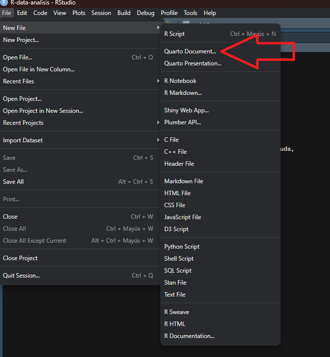
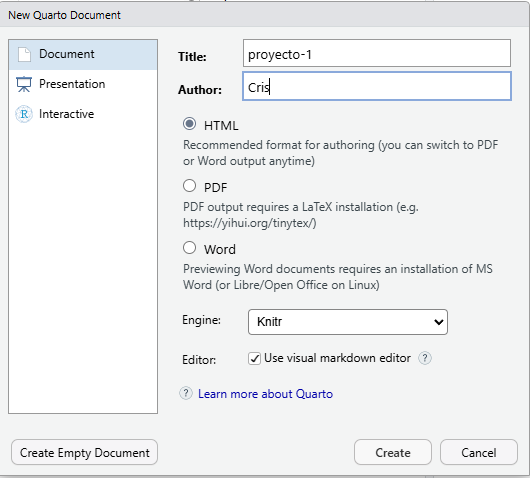
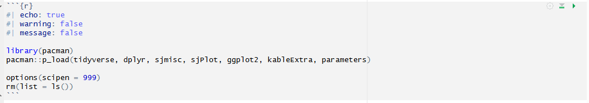

# ¿Por qué documentos dinámicos?

En el trabajo cuantitativo, el flujo habitual consiste en correr código en R, copiar resultados a un procesador de texto, ajustar manualmente tablas y gráficos, y repetir el ciclo cada vez que algo cambia. Este proceso es lento, propenso a errores y dificulta la **reproducibilidad**: la capacidad de que cualquier persona pueda llegar exactamente a los mismos resultados a partir de los mismos datos y procedimientos.

Los **documentos dinámicos** resuelven este problema al integrar en un solo archivo el texto, el código y los resultados del análisis. Si los datos cambian, el documento se actualiza automáticamente al renderizarlo.

## Reproducibilidad

La reproducibilidad es un principio central de la ciencia abierta. Un análisis es reproducible cuando:

-   El código fuente está disponible y documentado.
-   Los datos de entrada están accesibles o descritos con precisión.
-   El entorno de trabajo (paquetes, versiones) está registrado.
-   Cualquier persona puede llegar al mismo resultado siguiendo los mismos pasos.

## Markdown vs. Quarto

| Concepto | Descripción |
|------------------------------------|------------------------------------|
| **Markdown** | Lenguaje de texto plano con marcas mínimas de formato (`.md`). Solo texto y estructura. |
| **R Markdown** | Extensión de Markdown que permite incluir código R ejecutable (`.Rmd`). Específico para R. |
| **Quarto** | Sistema moderno y multilenguaje (R, Python, Julia) para documentos dinámicos (`.qmd`). Estándar actual del curso. |

------------------------------------------------------------------------

# Creamos nuestro primer archivo .qmd

## Creación del archivo

1. Nos vamos a la sección File -> New File -> Quarto Document... 



2. Creamos un nombre del documento y autor/a. Le damos a Create. 



## Trabajando el documento

### Escritura plana

Todo el texto de un archivo `.qmd` se escribe en Markdown.

| Código | Resultado |
|---------------------------------------|---------------------------------|
| `**negrita**` | **negrita** |
| `*cursiva*` | *cursiva* |
| `# Título 1` | \# Encabezado de nivel 1 |
| `## Título 2` | \## Encabezado de nivel 2 |
| `[texto](https://https://www.markdownguide.org/)` | [link](https://www.markdownguide.org/) |
| `` |  |
| `> cita` | \> cita |
| `- ítem` | Lista |
| `1. lista` | Lista ordenada |

### Códigos: Chunks!!!

Para poder escribir código de análisis en un documento Quarto debemos generar un trozo de código llamado ‘Chunk’, que se puede crear con ctrl+alt+i o directamente en el menú de arriba en ‘Code -> Insert Chunk’.



* Los chunks comienzan y terminan con ```
* {R} Se refiere al lenguaje de programación. En este caso: R
* Cada chunks puede ir con diferentes opciones. Por defecto, si no se introduce ninguna especificación, vienen como TRUE


| Opción    | Descripción                                   |
|-----------|-----------------------------------------------|
| `echo`    | Muestra u oculta el código fuente             |
| `eval`    | Ejecuta o no el código                        |
| `output`  | Incluye o excluye los resultados              |
| `warning` | Muestra u oculta advertencias                 |
| `message` | Muestra u oculta mensajes de carga            |
| `include` | Control global: suprime código y resultados   |
| `label`   | Identifica el chunk para referencias cruzadas |
| `fig-cap` | Título para gráficos (`label: fig-...`)       |
| `tbl-cap` | Título para tablas (`label: tbl-...`)         |


### Referencias Cruzadas: Tablas y gráficos!!!


1. Label en tablas

Para tablas, debe empezar con el prefijo label: tbl-nombre

Esto permite que Quarto reconozca el bloque como una tabla numerable y que puedas crear enlaces hacia ella desde el texto.

2. Referencias Cruzadas

Sintaxis Estándar: Se usa `@tbl-label`. Quarto lo reemplazará automáticamente por "Tabla 1", "Tabla 2", etc.

La numeración (1, 2, 3...) depende exclusivamente del orden de aparición en el documento.

No puedes forzar que la quinta tabla creada sea la "Tabla 1" manualmente mediante código; si necesitas cambiar el orden, debes mover el bloque de código físicamente hacia arriba o hacia abajo en el archivo.

3. Tips!!!

* Sintaxis Personalizada: Si quieres que el enlace tenga un nombre propio (ej: "ver resumen de datos"), usa el formato de link: `[texto personalizado](@tbl-label)`.

* Al inicio de tu documento, crea un chunk (sin necesidad de label o cap) donde realices todo el procesamiento estadístico. Aquí guardas el resultado final en un objeto de R.

Más adelante, en el lugar exacto donde quieres que aparezca la tabla en tu informe, creas un chunk pequeño que solo contenga el label, el caption y el nombre del objeto


4. Gráficos:

Para los gráficos el label cambia a `@fig-nombre`

------------------------------------------------------------------------

# Aplicación práctica: Estatus Social Subjetivo

## Preparación

Primero veamos un chunks creado desde 0. Cargaremos nuestras librerías:

```{r}
pacman::p_load(ggplot2, dplyr, kable, kableExtra)

```
<br>

Para no ver estos warning o mensajes cambiamos las opciones del chunks a FALSE

```{r}
#| echo: true
#| warning: false 
#| message: false

pacman::p_load(tidyverse, dplyr, sjmisc, sjPlot, ggplot2, kableExtra, parameters)

options(scipen = 999)
rm(list = ls())
```

## Carga de datos

```{r}
#| echo: true
#| warning: false
#| message: false

load(url("https://github.com/Cristobal-Mejias-G/Clase-4-MC-FAGOB/raw/main/input/data/issp_2009_chile.RData"))

names(issp)
glimpse(issp)
```

## Tabla descriptiva

```{r}
#| echo: true
#| warning: false
#| label: tbl-desc
#| tbl-cap: "Estadísticos descriptivos de variables seleccionadas"

sjmisc::descr(issp,
      show = c("label","range", "mean", "sd", "NA.prc", "n"))%>% # Selecciona estadísticos
      kable(.,"markdown") # Esto es para que se vea bien en quarto

```

La [tabla descriptiva](tbl-desc) resume las variables a trabajar

## Modelo de regresión lineal

```{r}
#| echo: true
#| warning: false

modelo_1 <- lm(topbot ~ educyrs,          data = issp)
modelo_2 <- lm(topbot ~ educyrs + income, data = issp)
```

## Tabla de regresión con sjPlot

```{r}
#| echo: true
#| warning: false
#| label: tbl-reg
#| tbl-cap: "Modelos de regresión: Estatus Social Subjetivo"

sjPlot::tab_model(
  modelo_1, modelo_2,
  show.ci     = FALSE,
  show.se     = TRUE,
  dv.labels   = c("Modelo 1", "Modelo 2"),
  pred.labels = c("(Intercepto)", "Educación (nivel educativo)", "Ingreso (decíles"),
  title       = "Variable dependiente: Estatus Social Subjetivo (1–10)"
)
```

## Visualización

```{r}
#| echo: true
#| warning: false
#| message: false
#| label: fig-ess
#| fig-cap: "Relación entre educación y estatus social subjetivo"

ggplot(issp, aes(x = educyrs, y = topbot)) +
  geom_jitter(alpha = 0.2, color = "#3498db", width = 0.3, height = 0.3) +
  geom_smooth(method = "lm", se = TRUE, color = "#e74c3c", linewidth = 1.2) +
  labs(
    title   = "Estatus social subjetivo según nivel educativo",
    x       = "Educación (nivel educativo)",
    y       = "Estatus social subjetivo (1–10)",
    caption = "Fuente: Elaboración propia en base a ISSP."
  ) +
  theme_minimal(base_size = 13) +
  theme(plot.title = element_text(face = "bold"))
```

La @fig-ess muestra la asociación positiva entre años de escolaridad y el estatus percibido.

------------------------------------------------------------------------

# De Documento a Presentación

Una ventaja clave de Quarto es que **el mismo archivo puede convertirse en distintos formatos** simplemente cambiando el YAML.

## Cambiar el formato

**Documento HTML:**

``` yaml
format: html
```

**Presentación RevealJS:**

``` yaml
format: revealjs
```

## Separar diapositivas

Los encabezados `#` y `##` crean diapositivas automáticamente. También se puede usar `---` para separar manualmente:

``` markdown
## Primera diapositiva

Contenido aquí.

---

Nueva diapositiva sin título.
```

## Opciones útiles de RevealJS

``` yaml
format:
  revealjs:
    theme: simple
    slide-number: true
    incremental: true
```


------------------------------------------------------------------------

# Recursos para profundizar

- [Creación de documentos científicos con Quarto]("https://aprendeconalf.es/quarto-textos-cientificos/")
- [Quarto]("https://quarto.org/")
- [Video tutorial]("youtube.com/watch?v=EbAAmrB0luA&feature=youtu.be")


------------------------------------------------------------------------

*Documento creado para el curso Métodos Cuantitativos para la Administración Pública· Cristóbal Mejías*\
*Sesión 4 · 17 de abril de 2026*
